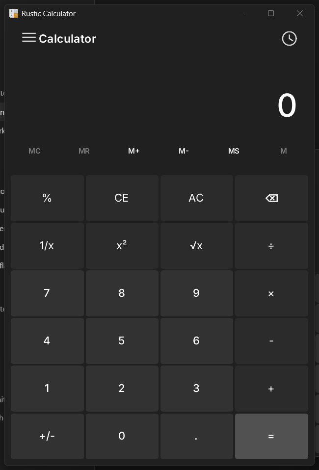

# Rustic Calculator

A Rust desktop calculator and unit converter built with Slint.



## Features

- Standard calculator with keyboard input, calculation history, and Ctrl+V paste for numbers or full operations.
- Unit converters for volume, length, weight and mass, temperature, energy, area, speed, time, power, data, pressure, and angle.
- Dark Windows-style desktop UI.
- Persistent window size, position, and expanded history layout.

## Run

```powershell
cargo run
```

## Production Build

```powershell
cargo build --release
```

The optimized Windows executable is generated at:

```text
target/release/rustic-calculator.exe
```

## Release

A GitHub release is created automatically when a version tag is pushed:

```powershell
git push origin master
git tag v1.1.0
git push origin v1.1.0
```

The release workflow builds the optimized Windows executable and attaches a zipped `rustic-calculator.exe` package.

## Check

```powershell
cargo test
cargo clippy --all-targets -- -D warnings
```

## Structure

- `ui/main_window.slint` is the root window and view composition.
- `ui/components/` contains reusable Slint UI controls.
- `ui/views/` contains app screens and panels.
- `src/calculator.rs` contains calculator state and arithmetic rules.
- `src/converter_app.rs` contains converter UI state.
- `src/features/converters.rs` contains conversion data and formulas.
- `src/app.rs` connects the Slint UI to Rust state.

## License

Rustic Calculator is licensed under the MIT License. See `LICENSE`.

## Attribution

- Calculator app icon by Apien from Flaticon.
- Inter font licensed under the SIL Open Font License.
